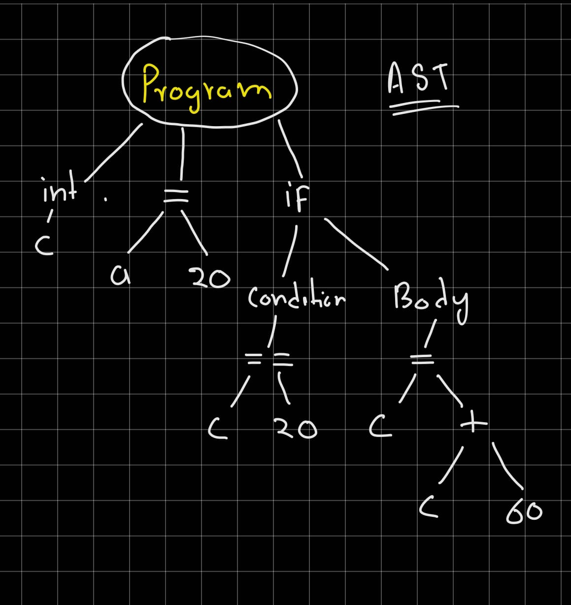
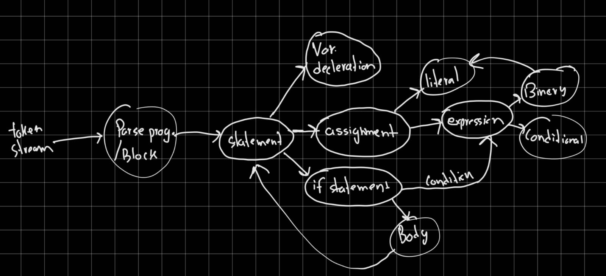

SimpleLang: A Basic High-Level Language for an 8-bit CPU 
=========================

This assignment contains:

* Construct of SimpleLang compiler usiing C lang.
* compiler is divided between different phases
    * [Lexer](#reading-file-and-lexer)
    * [Parser](#parser-forming-abastract-syntex-tree-and-semantic-analysis)
    * [Assembly code generation](#assmbly-code-generation) 
* **language support** `variable decleration(int)` , `arithmetic operation(+,-)` , `assignment(=)` , `contitonal opertaion if(==, !=)` , `nested if condition`

***Note*** 
> 8-bit computer by lightcode was based on python-2 and designed to run on linux terminal, in this assignment i have modified the source code for *python-3   on windows*

## How ro run SimpleLang code
Since compiler include multiple components and Bash command so it would be best to include every components and Bash command in single instruction. *this include running 8-bit computer simulator*

- start by write the SimpleLang code in a text file
- run the following terminal command in simulator directory
        
    - simplelang <"file name">.txt

```
simplelang code.txt
``` 
>example code
```
int c;
c=20;
if(c==20){
c=c+60;
}
```
>output
```
VCD info: dumpfile machine.vcd opened for output.
Memory: set [0x17] => 0x14 ( 20)
Memory: set [0x17] => 0x50 ( 80)
Output:  80 ($50)
============================================
CPU halted normally.
REGISTERS: A: 50, B: 3c, C: xx, D: xx, E: xx, F: xx, G: xx, Temp: xx
rtl/tb/machine_tb.v:54: $stop called at 1860 (1s)
```

## Explanation and Working
## Reading file and Lexer
in the first phase, simplelang.exe binary will read the code file & store the data in a string buffer.
next we will pass the buffer to the  `tokenize(const char * )`
>generated tokens -
```
<0,int>  <2,c> <12,;>  <2,c>  <4,=>  <3,20>  <12,;> <1,if>  <8,(>  <2,c>  <7,==>  <3,20>  <9,)>  <10,{>  <2,c>  <4,=>  <2,c>  <5,+>  <3,60>  <12,;>  <11,}>  <13,EOF>
```
* in this phase, compiler will check for all symbol,keyword,identifiers that are defined in the construct and tokenize the program with it type as bellow mentioned 

``
typedef enum {
    TOKEN_INT, TOKEN_IF, TOKEN_IDENTIFIER, TOKEN_NUMBER,
    TOKEN_ASSIGN, TOKEN_PLUS, TOKEN_MINUS, TOKEN_CONDITION, 
    TOKEN_LPAREN, TOKEN_RPAREN, TOKEN_LBRACE, TOKEN_RBRACE,
    TOKEN_SEMICOLON, TOKEN_EOF, TOKEN_UNKNOWN
}TokenType;
``
## Parser (forming Abastract Syntex Tree) and Semantic analysis
this is the most crucial phase of compiler, this creates a AST, that represents the structure of the source code of computer program and ensures it follows the gramamtical rules , during the parsing and semantic check , the compiler ensures to check the variable decleration.
>function call `ASTMain* parseProgram()` 



>AST function calls



typedef enum {
    NODE_VAR_DECL, NODE_ASSIGN, NODE_BINARY_OP, NODE_IF, NODE_LITERAL, NODE_IDENTIFIER, NODE_CONDITION
} ASTNodeType;

## Assmbly Code Generation

in this phase travers through the AST tree and provies the suitable Instruction sets for 8-bit simulator computer
>function call `void generateAssembly(ASTMain* node)`

>example
```
int a=10
```
>output assembly
```
ldi A 10
sta %a
```
>here is the final assembly code for above AST
```
.text

    ldi A 20
    sta %c
    lda %c
    ldi B 20
    cmp
    je %IF_TRUE_0
    jmp %END_IF_0
    IF_TRUE_0:
    lda %c
    ldi B 60
    add
    sta %c
    END_IF_0:
    out 0
    hlt

.data

    c = 0
```

